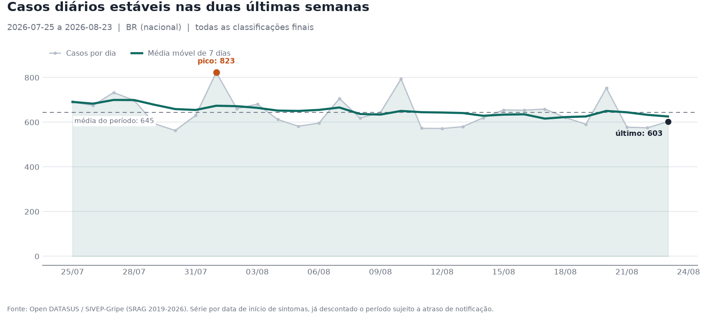
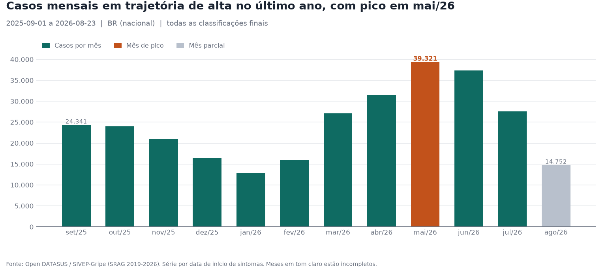

> Exemplo de relatorio gerado por `python main.py --no-llm` sobre a base do Open DATASUS (2019, 2022-2026), via deterministica. Caminhos locais substituidos por `<repo>`. Regere com `make demo`; o conteudo muda a cada republicacao da fonte.

# Relatorio epidemiologico de SRAG

> **Certificação AI Engineering - Vinícius Barbaresco**

- **Execucao (run_id):** `3e32fd30-e002-4d9e-9d11-0ee3a406efeb`
- **Gerado em:** 2026-09-18 00:04 Hora oficial do Brasil
- **Solicitacao:** Gere o relatorio de monitoramento de SRAG com os indicadores de aumento de casos, letalidade entre casos encerrados, UTI (admissao e ocupacao de leitos) e vacinacao, as series diaria e mensal, e o contexto de noticias recentes.
- **Recorte:** BR (nacional) | todas as classificações finais
- **Fonte dos dados:** Open DATASUS / SIVEP-Gripe (SRAG 2019-2026) ([dataset](https://dadosabertos.saude.gov.br/dataset/srag-2019-a-2026))
- **Via de interpretacao:** `deterministic-template`

> Este relatório apresenta análise epidemiológica agregada de dados públicos de vigilância. Não constitui diagnóstico, prescrição, recomendação terapêutica nem orientação de conduta clínica individual.

## Resumo dos indicadores

| # | Indicador | Valor | Numerador | Denominador | Status |
|---|-----------|-------|-----------|-------------|--------|
| 1 | case_growth_rate | -33.22% | -9619 | 28955 | calculado |
| 2 | mortality_rate | 5.33% | 715 | 13404 | calculado |
| 3 | icu_admission_rate | 28.64% | 4912 | 17151 | calculado |
| 4 | icu_bed_occupancy_rate [*] | 7.7% | 3988 | 51774 | calculado |
| 5 | vaccination_coverage_among_cases | 39.93% | 7636 | 19124 | calculado |
| 6 | incidence_rate | 9.03 por 100 mil hab. no periodo | 19336 | 214211951 | calculado |
| 7 | seasonal_excess | -12.08% | -2657 | 21993 | calculado |

`[*]` mede so a parcela ocupada por pacientes de SRAG (piso da ocupacao real, nao a ocupacao total) e cobre uma janela deslocada para tras em relacao aos demais indicadores -- ver secao 3b para o periodo exato.

## DADO - Alertas e acompanhamento

**Nivel consolidado: NORMAL.** Nenhuma regra de alerta disparada; indicadores dentro dos limiares configurados.

| Regra | Indicador | Observado | Limiar | Disparada |
|-------|-----------|-----------|--------|-----------|
| crescimento_de_casos | case_growth_rate | -33.22% | 20.0% | nao |
| letalidade | mortality_rate | 5.33% | 10.0% | nao |
| excesso_sazonal | seasonal_excess | -12.08% | 50.0% | nao |

### Variacao desde a execucao anterior

- **Execucao anterior:** `e5f42f8b-f268-4e5a-9dc3-6b3adedaad44` (gerada em 2026-09-18T02:59:55, corte 2026-08-23; corte atual 2026-08-23)

| Indicador | Anterior | Atual | Variacao |
|-----------|----------|-------|----------|
| case_growth_rate | -33.22 | -33.22 | 0.0 |
| mortality_rate | 5.33 | 5.33 | 0.0 |
| icu_admission_rate | 28.64 | 28.64 | 0.0 |
| vaccination_coverage_among_cases | 39.93 | 39.93 | 0.0 |
| incidence_rate | 9.03 | 9.03 | 0.0 |
| seasonal_excess | -12.08 | -12.08 | 0.0 |

*As duas execucoes usam a mesma data de corte analitica: a variacao reflete atualizacao da base pela fonte, nao passagem do tempo.*

## DADO - Indicadores epidemiologicos

### 1. Taxa de aumento de casos

**Valor:** -33.22%

- **Definicao:** Variacao percentual do numero de casos de SRAG entre duas janelas consecutivas de mesmo tamanho, medidas pela data dos primeiros sintomas: (casos_periodo_atual - casos_periodo_anterior) / casos_periodo_anterior x 100.
- **Numerador:** -9619
- **Denominador:** 28955
- **Registros na base do calculo:** 48291
- **Periodo:** 2026-06-25 a 2026-08-23 (janela atual 2026-07-25 a 2026-08-23 comparada a 2026-06-25 a 2026-07-24)
- **Fonte:** Open DATASUS / SIVEP-Gripe (SRAG 2019-2026)
- **Casos na janela atual:** 19336
- **Casos na janela anterior:** 28955
- **Data de corte analitica:** 2026-08-23 (atraso mediano observado: 7.0 dias, p90: 27.0 dias)

Limitacoes declaradas

- A serie recente e incompleta por atraso de notificacao: casos com sintomas nos ultimos dias ainda nao foram digitados. As janelas excluem os dias mais recentes (REPORTING_LAG_DAYS) e usam como referencia a maior data de digitacao da base, nunca a data de hoje.
- As duas janelas sao comparadas com maturidade simetrica: cada uma e contada como era conhecida REPORTING_LAG_DAYS dias apos o proprio fechamento. Sem isso a janela atual teria menos tempo de digitacao que a anterior e o crescimento sairia subestimado de forma sistematica. As contagens sem censura ficam publicadas ao lado, nos componentes.
- Mede variacao de casos notificados, nao incidencia populacional: nao ha denominador populacional no dataset.
- Quando a janela anterior tem zero casos, a variacao percentual e indefinida e o indicador retorna valor nulo.
- O SIVEP-Gripe registra casos de SRAG notificados, majoritariamente hospitalizados. Nenhum indicador aqui representa a populacao geral.

### 2. Letalidade entre casos encerrados

**Valor:** 5.33%

- **Definicao:** Proporcao de obitos por SRAG entre os casos encerrados elegiveis: obitos (EVOLUCAO = 2) / casos encerrados (EVOLUCAO em 1, 2 ou 3) x 100.
- **Numerador:** 715
- **Denominador:** 13404
- **Registros na base do calculo:** 19336
- **Periodo:** 2026-07-25 a 2026-08-23 (ultimos 30 dias ate a data de corte analitica)
- **Fonte:** Open DATASUS / SIVEP-Gripe (SRAG 2019-2026)
- **Casos no periodo:** 19336
- **Obitos por SRAG:** 715
- **Obitos por outras causas:** 371
- **Casos ainda em aberto:** 5437
- **Evolucao ignorada (codigo 9):** 495

Limitacoes declaradas

- Trata-se de letalidade (case fatality ratio) entre casos notificados de SRAG, nao de mortalidade populacional por SRAG.
- Casos recentes ainda sem encerramento ficam fora do denominador. Como obitos costumam ser encerrados antes das curas, a letalidade da janela recente tende a ser SUPERESTIMADA; o percentual de casos em aberto e o percentual encerrado sao publicados junto do indicador para dimensionar esse vies.
- Duas janelas com percentuais de encerramento diferentes NAO sao diretamente comparaveis: a variacao entre elas pode ser artefato de maturacao, e nao mudanca real de gravidade. Por isso o indicador publica em `coorte_madura` a mesma taxa sobre uma janela deslocada o tempo tipico ate o encerramento (percentil 90 medido na propria base), com o percentual encerrado das duas. Na base de referencia a janela recente marca 7,86% com 68,8% encerrado, contra 6,04% com 85,5% na coorte madura -- a diferenca e maturacao, nao gravidade.
- EVOLUCAO = 3 (obito por outras causas) entra no denominador como caso encerrado, mas nao no numerador.
- A serie recente e incompleta por atraso de notificacao: casos com sintomas nos ultimos dias ainda nao foram digitados. As janelas excluem os dias mais recentes (REPORTING_LAG_DAYS) e usam como referencia a maior data de digitacao da base, nunca a data de hoje.
- O SIVEP-Gripe registra casos de SRAG notificados, majoritariamente hospitalizados. Nenhum indicador aqui representa a populacao geral.

### 3. UTI (admissao e censo)

**Valor:** 28.64%

- **Definicao:** Proporcao de pacientes internados por SRAG que foram admitidos em UTI: UTI = 1 / (UTI em 1 ou 2), restrito a internados. Um caso e considerado internado quando HOSPITAL = 1 **ou** quando ha admissao em UTI declarada (UTI = 1).
- **Numerador:** 4912
- **Denominador:** 17151
- **Registros na base do calculo:** 19045
- **Periodo:** 2026-07-25 a 2026-08-23 (ultimos 30 dias ate a data de corte analitica)
- **Fonte:** Open DATASUS / SIVEP-Gripe (SRAG 2019-2026)
- **Internados no periodo:** 19045
- **Admitidos em UTI:** 4912
- **UTI ignorado (codigo 9):** 199
- **Pico do censo diario em UTI:** 0 pacientes em None (None% desse valor depende de imputacao de permanencia)
- **Com UTI informado e sem HOSPITAL='Sim':** ausente 135, ignorado 0 (contam como internados nos dois bracos: a base e de SRAG hospitalizada e ausencia nao e lida como 'Nao')
- **Admitidos em UTI com internacao negada:** 0 (contradicao no registro; nao sao resgatados)

**Qualidade da permanencia em UTI usada no censo** (estadias em UTI que intersectam a janela do censo):

- Estadias no censo: 7918
- Com data de saida registrada: 3121 (39.42%)
- Permanencia imputada pela data de evolucao: 1960
- **Permanencia imputada em aberto: 2837 (35.83%)**
- Estadias imputadas truncadas pelo teto de 31 dias (percentil 95% da permanencia das 261831 estadias com saida registrada): 1471 -- o teto limita tanto a imputacao pela data de evolucao quanto a imputacao em aberto
- Estadias sem data de saida nem de evolucao sao tratadas como em curso ate o teto de permanencia. Sem o teto, pacientes admitidos meses antes contavam como internados ate a data de corte e inflavam o censo em ordem de grandeza.

> **Este indicador nao e ocupacao de leitos.** Indicador distinto, calculado a parte com a capacidade instalada do CNES. A taxa de admissao acima NAO e ocupacao: ela mede severidade dos casos notificados, nao pressao sobre a capacidade instalada. A ocupacao e publicada em separado como `icu_bed_occupancy_rate`.

Limitacoes declaradas

- ATENCAO: este indicador NAO e taxa de ocupacao de leitos de UTI. O campo 53 do SIVEP-Gripe ('Internado em UTI?') registra se houve admissao em UTI, nao a ocupacao da capacidade instalada.
- Mede severidade clinica dos casos notificados, nao pressao sobre a rede hospitalar.
- A serie recente e incompleta por atraso de notificacao: casos com sintomas nos ultimos dias ainda nao foram digitados. As janelas excluem os dias mais recentes (REPORTING_LAG_DAYS) e usam como referencia a maior data de digitacao da base, nunca a data de hoje.
- O SIVEP-Gripe registra casos de SRAG notificados, majoritariamente hospitalizados. Nenhum indicador aqui representa a populacao geral.

### 3b. Ocupacao de leitos de UTI por pacientes de SRAG

**Valor:** 7.7%

- **Definicao:** Proporcao da capacidade instalada de UTI ocupada por pacientes de SRAG em um dia: pacientes_srag_em_uti_no_dia / leitos_uti_disponiveis_no_dia x 100. O numerador vem do censo diario calculado sobre o SIVEP-Gripe; o denominador vem da capacidade instalada publicada pelo CNES para a UF e a competencia compativel com a janela analisada.
- **Numerador:** 3988
- **Denominador:** 51774
- **Registros na base do calculo:** 111298
- **Periodo:** 2026-06-24 a 2026-07-23 (30 dias encerrados 31 dias antes da data de corte analitica, para que as saidas de UTI ja estejam digitadas)
- **Fonte:** Open DATASUS / SIVEP-Gripe (SRAG 2019-2026) (pacientes) e CNES / Dados Abertos do SUS (leitos)
- **Formula:** `pacientes_srag_em_uti_no_dia / leitos_uti_disponiveis_no_dia * 100`
- **Dia publicado:** 2026-06-24 (dia de pico do censo dentro da janela madura deslocada)
- **Janela madura:** 2026-06-24 a 2026-07-23 -- deslocada 31 dias para tras porque a cauda recente do censo depende de saidas ainda nao digitadas; o teto de permanencia medido (31 dias) e o tempo necessario para que a estadia ja esteja encerrada no registro
- **Numerador (pacientes de SRAG em UTI no dia):** 3988 (63.26% depende de imputacao de permanencia)
- **Denominador (leitos de UTI existentes):** 51774 (dos quais 26149 destinados ao SUS)
- **Competencia do CNES usada:** 2026-07 (1 mes(es) de distancia da data de corte analitica; limite configurado: ICU_CAPACITY_MAX_LAG_MONTHS)
- **Cobertura geografica da capacidade:** 27 UF(s), exigidas 27
- **Tipos de leito no denominador:** UTI_ADULTO, UTI_PEDIATRICA
- **Ocupacao media na janela madura:** 7.17% (minimo 6.49%, 30 dias apurados)
- **Fonte da capacidade:** CNES / Portal de Dados Abertos do SUS - Hospitais e Leitos (CGHID/MS), capacidade instalada por competencia (extraida em 2026-09-17)

> **Alcance:** parcela da capacidade de UTI ocupada por pacientes de SRAG notificados; e um piso da ocupacao total, que inclui pacientes sem SRAG. Um valor baixo **nao** significa rede com folga.

> **Periodo distinto.** este periodo NAO coincide com o dos demais indicadores, que vao ate 2026-08-23. Comparar a ocupacao com eles exige levar o deslocamento em conta

Limitacoes declaradas

- MEDE APENAS A PARCELA DE SRAG. O numerador conta pacientes de SRAG notificados em UTI; os leitos do denominador tambem atendem pacientes sem SRAG (trauma, pos-operatorio, sepse de outras causas). O valor e portanto um PISO da ocupacao total de UTI, nao a ocupacao total. Um valor baixo NAO significa rede com folga.
- O numerador depende da imputacao de permanencia das estadias sem data de saida registrada; o percentual imputado no dia publicado acompanha o indicador.
- A capacidade do CNES e o cadastro de leitos, nao leitos operacionais no dia: leito cadastrado pode estar bloqueado por falta de equipe. O denominador tende a superestimar a capacidade efetiva e, com isso, a subestimar a ocupacao.
- Numerador e denominador tem defasagens diferentes e competencias distintas; a competencia usada e a distancia dela ate a janela sao publicadas com o valor.
- O recorte geografico e a UF de NOTIFICACAO, nao a de residencia: o leito e ocupado onde o paciente foi internado.
- Leitos de UTI neonatal, de queimados e coronariana ficam fora do denominador: sao unidades fechadas para outras condicoes e nao estao disponiveis para o paciente de SRAG. Os quantitativos continuam na referencia e podem ser auditados.
- A serie recente e incompleta por atraso de notificacao: casos com sintomas nos ultimos dias ainda nao foram digitados. As janelas excluem os dias mais recentes (REPORTING_LAG_DAYS) e usam como referencia a maior data de digitacao da base, nunca a data de hoje.

### 4. Cobertura vacinal

**Valor:** 39.93%

- **Definicao:** Proporcao de casos notificados de SRAG com vacinacao declarada: VACINA_COV = 1 / (VACINA_COV em 1 ou 2) para covid-19, e VACINA = 1 / (VACINA em 1 ou 2) para influenza.
- **Numerador:** 7636
- **Denominador:** 19124
- **Registros na base do calculo:** 19336
- **Periodo:** 2026-07-25 a 2026-08-23 (ultimos 30 dias ate a data de corte analitica)
- **Fonte:** Open DATASUS / SIVEP-Gripe (SRAG 2019-2026)
- **Covid-19:** 39.93% (7636 de 19124), completude da informacao 98.9%
- **Influenza:** 35.48% (6492 de 18300), completude da informacao 94.64%

**Taxa de vacinacao da populacao** (referencia externa, ano 2026):

- **covid19:** nao calculavel -- A referencia de doses aplicadas para esta campanha nao declara cobertura de periodo completo (`periodo_completo=true`); os registros disponiveis somam 427874 doses, mas podem ser um extrato mensal isolado do SI-PNI. Um recorte parcial dividido pela populacao do ano nao e cobertura vacinal anual nem populacional -- e um numero sem significado epidemiologico. Agregue todos os extratos mensais da campanha com `python -m src.data.reference.vaccination --from-pni ... --periodo-completo` para habilitar este indicador.
- **influenza:** nao calculavel -- A referencia de doses aplicadas para esta campanha nao declara cobertura de periodo completo (`periodo_completo=true`); os registros disponiveis somam 403884 doses, mas podem ser um extrato mensal isolado do SI-PNI. Um recorte parcial dividido pela populacao do ano nao e cobertura vacinal anual nem populacional -- e um numero sem significado epidemiologico. Agregue todos os extratos mensais da campanha com `python -m src.data.reference.vaccination --from-pni ... --periodo-completo` para habilitar este indicador.

Limitacoes declaradas

- ATENCAO: este indicador NAO e taxa de vacinacao da populacao. O denominador sao casos notificados de SRAG (majoritariamente hospitalizados), um grupo com perfil de risco distinto da populacao geral -- ha vies de selecao por definicao.
- A informacao e declarada no momento da notificacao e depende da apresentacao da caderneta; a subnotificacao de doses e conhecida.
- A cobertura vacinal populacional e um indicador SEPARADO (`population_vaccination_coverage`), com numerador do SI-PNI e denominador demografico. Esta metrica nunca deve ser lida no lugar dela, nem usada como aproximacao dela.
- O SIVEP-Gripe registra casos de SRAG notificados, majoritariamente hospitalizados. Nenhum indicador aqui representa a populacao geral.

### 5. Incidencia por 100 mil habitantes (complementar)

**Valor:** 9.03 por 100 mil hab. no periodo

- **Definicao:** Casos de SRAG com primeiros sintomas na janela analisada, por 100 mil habitantes: casos / populacao residente estimada (IBGE) x 100.000.
- **Numerador:** 19336
- **Denominador:** 214211951
- **Registros na base do calculo:** 19336
- **Periodo:** 2026-07-25 a 2026-08-23 (ultimos 30 dias ate a data de corte analitica)
- **Fonte:** Open DATASUS / SIVEP-Gripe (SRAG 2019-2026) (casos) e IBGE (populacao)
- **Casos na janela:** 19336
- **Populacao de referencia:** 214211951 (IBGE - populacao residente estimada (tabela 6579), estimativa de 2026)

Limitacoes declaradas

- Incidencia de casos NOTIFICADOS de SRAG (majoritariamente hospitalizados), nao de infeccao respiratoria na populacao.
- O recorte geografico e a UF de RESIDENCIA, para casar com o denominador residente do IBGE. Os indicadores de carga assistencial (UTI, ventilacao, censo) usam a UF de NOTIFICACAO, porque o leito e ocupado onde o paciente foi internado. As duas dimensoes nao sao intercambiaveis e nunca devem ser cruzadas numa mesma tabela.
- A populacao e a estimativa anual do IBGE mais proxima da data de corte; o ano usado e publicado junto do indicador.
- Permite comparar UFs de tamanhos diferentes, o que a contagem absoluta nao permite.
- A serie recente e incompleta por atraso de notificacao: casos com sintomas nos ultimos dias ainda nao foram digitados. As janelas excluem os dias mais recentes (REPORTING_LAG_DAYS) e usam como referencia a maior data de digitacao da base, nunca a data de hoje.

### 6. Excesso sobre o baseline sazonal (complementar)

**Valor:** -12.08%

- **Definicao:** Variacao percentual dos casos da janela atual em relacao a MEDIANA dos casos observados na mesma janela de calendario nos anos de baseline: (casos_atuais - mediana_baseline) / mediana_baseline x 100.
- **Numerador:** -2657
- **Denominador:** 21993
- **Registros na base do calculo:** 88774
- **Periodo:** 2026-07-25 a 2026-08-23 (janela atual de 30 dias comparada a mesma janela de calendario em 3 ano(s) de baseline)
- **Fonte:** Open DATASUS / SIVEP-Gripe (SRAG 2019-2026)
- **Casos na janela atual:** 19336
- **Mediana do baseline:** 21993 (media: 23146.0)
- **Anos considerados:** [2022, 2023, 2024] (configurados: [2022, 2023, 2024]; ausentes na base: [])
- **Anos excluidos por definicao:** [2020, 2021] -- anos pandemicos de covid-19: volume de SRAG fora de qualquer padrao sazonal, incompativel com um baseline

| Ano | Janela comparada | Casos |
|-----|------------------|-------|
| 2022 | 2022-07-25 a 2022-08-23 | 28680 |
| 2023 | 2023-07-25 a 2023-08-23 | 18765 |
| 2024 | 2024-07-25 a 2024-08-23 | 21993 |

Limitacoes declaradas

- 2020 e 2021 ficam fora do baseline por padrao: a pandemia de covid-19 multiplicou as notificacoes de SRAG e um baseline que os incluisse rotularia qualquer ano normal como 'abaixo do esperado'.
- Mede se a janela atual esta acima ou abaixo do padrao historico da mesma epoca do ano -- e o que distingue surto de sazonalidade. A taxa de aumento de casos, que compara janelas consecutivas, nao faz essa distincao.
- Mudancas de criterio de notificacao e de cobertura da vigilancia entre os anos afetam a comparacao; os anos efetivamente usados sao publicados.
- A serie recente e incompleta por atraso de notificacao: casos com sintomas nos ultimos dias ainda nao foram digitados. As janelas excluem os dias mais recentes (REPORTING_LAG_DAYS) e usam como referencia a maior data de digitacao da base, nunca a data de hoje.

## DADO - Series temporais

### Casos diarios (2026-07-25 a 2026-08-23)

- Total no periodo: **19336** casos
- Media diaria: 644.53 | maximo: 823 | minimo: 563

### Casos mensais (2025-09-01 a 2026-08-23)

- Total no periodo: **292087** casos

| Mes | Casos | Observacao |
|-----|-------|------------|
| 2025-09 | 24341 |  |
| 2025-10 | 24030 |  |
| 2025-11 | 21011 |  |
| 2025-12 | 16349 |  |
| 2026-01 | 12824 |  |
| 2026-02 | 15912 |  |
| 2026-03 | 27092 |  |
| 2026-04 | 31530 |  |
| 2026-05 | 39321 |  |
| 2026-06 | 37384 |  |
| 2026-07 | 27541 |  |
| 2026-08 | 14752 | mes parcial |

## Visualizacoes

### Numero diario de casos de SRAG - ultimos 30 dias

Arquivo: `<repo>\outputs\charts\casos_diarios.png`

### Numero mensal de casos de SRAG - ultimos 12 meses

Arquivo: `<repo>\outputs\charts\casos_mensais.png`

## DADO - Atualidade da base e datas de referencia

| Data | Valor | O que e |
|------|-------|---------|
| Data atual do sistema | 2026-09-18 | dia em que o relatorio foi executado. NAO e a data ate a qual ha dado disponivel. |
| Sintomas mais recentes na base | 2026-09-13 | ha fichas com sintomas depois da data de corte; elas existem, mas a janela nao as usa porque a digitacao delas ainda esta incompleta |
| Digitacao mais recente na base | 2026-09-13 | ultima ficha digitada presente no arquivo publicado pelo DATASUS; e a ancora de todas as janelas, no lugar de hoje |
| **Corte epidemiologico** | **2026-08-23** | ultimo dia considerado confiavel: a data de digitacao menos o atraso de notificacao configurado. Todo indicador termina aqui |

- **Atraso de notificacao configurado:** 21 dias (`REPORTING_LAG_DAYS`)
- **Defasagem entre hoje e a ultima digitacao:** 5 dias
- **Defasagem entre hoje e o corte epidemiologico:** 26 dias
- **Arquivo bruto obtido da fonte em:** 2026-09-14T04:09:57 (anos 2019, 2022, 2023, 2024, 2025, 2026) -- data em que o arquivo foi baixado do Open DATASUS, nao a data de publicacao da safra pela fonte

> A data de execucao **nao** e a data ate a qual ha dado. O DATASUS publica com defasagem, e o sistema ainda desconta o atraso de notificacao para nao ler digitacao pendente como queda de casos.

## DADO - Sensibilidade a linhas identicas

- **Criterio:** linhas identicas em todas as colunas persistidas, exceto `ajustes_aplicados`, que descreve o tratamento e nao o conteudo
- **Casos na janela:** 19336 (seriam 19300 se colapsadas)
- **Linhas identicas excedentes:** 36 (0.19% da janela)

| Indicador | Publicado | Se deduplicado | Diferenca |
|-----------|-----------|----------------|-----------|
| letalidade entre casos encerrados | 5.33% | 5.34% | 0.01 p.p. |
| taxa de admissao em UTI entre internados | 28.64% | 28.65% | 0.01 p.p. |
| cobertura vacinal declarada (covid-19) entre casos | 39.93% | 39.97% | 0.04 p.p. |

**Veredito:** Nenhum indicador se desloca mais que 0.5 ponto percentual quando as linhas identicas sao colapsadas: a duplicidade nao e fonte relevante de erro nesta janela, diante das incertezas ja declaradas.

> **Decisao de tratamento.** A contagem principal NAO e deduplicada. Sem o identificador da notificacao -- negado por minimizacao -- nao ha como distinguir duplicata real de dois pacientes distintos com os mesmos atributos agregados, e os erros nao sao simetricos: deduplicar remove casos reais de forma irreversivel, enquanto nao deduplicar mantem um excedente pequeno e mensuravel, quantificado aqui.

> **Pseudonimizacao.** Pseudonimizacao irreversivel do identificador da notificacao foi avaliada e RECUSADA: o pseudonimo continua sendo dado pessoal (identificador direto e estavel de uma notificacao), reverter um hash sobre um espaco pequeno e viavel, e o ganho seria desproporcional -- a fonte tem zero NU_NOTIFIC repetido e zero linhas identicas nas 194 colunas brutas.

## Qualidade e tratamento dos dados

- **Carga (run_id):** `5303787c-c8c3-46f7-bcbf-20925d056f98`
- **Processada em:** 2026-09-16T20:37:29
- **Arquivos de origem:** INFLUD19-23-03-2026.csv, INFLUD22-23-03-2026.csv, INFLUD23-23-03-2026.csv, INFLUD24-23-03-2026.csv, INFLUD25-14-09-2026.csv, INFLUD26-14-09-2026.csv
- **Registros lidos:** 1.705.626
- **Registros descartados:** 0 (nenhum registro e removido silenciosamente)
- **Registros com valor alterado:** 45
- **Linhas identicas nas colunas lidas:** None (contadas, nao deduplicadas: sem o identificador da notificacao, excluido por minimizacao, nao ha como distinguir duplicata de pacientes distintos com os mesmos atributos agregados)
- **Codigos fora do dominio do dicionario:** nenhum (contados, nao anulados; a camada de metricas so reconhece codigos validos)

### Proveniencia dos dados

| Ano | Arquivo | sha256 | Origem |
|-----|---------|--------|--------|
| 2019 | `INFLUD19-23-03-2026.csv` | `f6de547c1234e2de...` | download do Open DATASUS |
| 2022 | `INFLUD22-23-03-2026.csv` | `57250ce92b916b4f...` | download do Open DATASUS |
| 2023 | `INFLUD23-23-03-2026.csv` | `639b748fb2838336...` | download do Open DATASUS |
| 2024 | `INFLUD24-23-03-2026.csv` | `b516f6eae61203da...` | download do Open DATASUS |
| 2025 | `INFLUD25-14-09-2026.csv` | `a507a213d043d5aa...` | download do Open DATASUS |
| 2026 | `INFLUD26-14-09-2026.csv` | `333afa53758437ed...` | download do Open DATASUS |

### Alteracoes de valor aplicadas

Toda alteracao e registrada no proprio registro, na coluna `ajustes_aplicados`. Os registros afetados podem ser localizados individualmente: `SELECT * FROM srag_cases WHERE ajustes_aplicados <> ''`.

| Codigo | Registros | Significado |
|--------|-----------|-------------|
| `idade_anulada` | 7 | idade normalizada fora do intervalo plausivel [0, 120] anos; substituida por nulo |
| `idade_unidade_implausivel` | 38 | NU_IDADE_N fora do dominio aceito para a unidade em TP_IDADE (1-dia admite 0 a 30; 2-mes admite 0 a 11); a idade derivada foi anulada. A unidade NAO e reinterpretada: nao ha como saber se o erro esta no numero ou na unidade, e escolher um dos dois seria inventar dado. O piso zero para meses diverge do dicionario, que declara 1 a 11: ver AGE_UNIT_DOMAIN. Foram medidos 5 registros na safra de referencia (-9, -1, 13, 37 e 63 meses) |

### Flags de coerencia

Marcadas por dimensao, nao como um unico veredito. Apenas a flag do eixo temporal exclui o registro da camada analitica; as demais sao respeitadas somente pelas metricas que dependem daquela dimensao.

| Flag | Registros | % | Exclui da analise | Significado |
|------|-----------|---|-------------------|-------------|
| `flag_data_invalida` | 573 | 0.034% | sim | eixo temporal primario inutilizavel: DT_SIN_PRI ausente, anterior ao inicio da serie ou posterior a data de digitacao. Unica flag que exclui o registro da view analitica, porque sem ela nenhuma metrica pode situar o caso no tempo. |
| `flag_internacao_inconsistente` | 23482 | 1.377% | nao | DT_INTERNA anterior aos primeiros sintomas, ou HOSPITAL=1 sem data de internacao. Afeta apenas indicadores que dependem da internacao. |
| `flag_uti_inconsistente` | 15233 | 0.893% | nao | DT_ENTUTI anterior aos primeiros sintomas, DT_SAIDUTI anterior a DT_ENTUTI, ou UTI=1 sem data de entrada. Afeta o censo de UTI, que depende da permanencia. |
| `flag_evolucao_inconsistente` | 91081 | 5.34% | nao | DT_EVOLUCA anterior aos primeiros sintomas, ou caso encerrado (EVOLUCAO em 1,2,3) sem data de evolucao. Nao afeta a taxa de mortalidade, que usa o codigo e nao a data, mas afeta a imputacao de permanencia em UTI. |
| `flag_data_implausivel` | 7724 | 0.453% | nao | alguma coluna de data traz um valor fora do intervalo fisicamente possivel -- anterior ao inicio da serie SIVEP-Gripe ou posterior a data de execucao da carga. Captura erros de digitacao de ano (1695, 2202, 5202, 8202 foram medidos na fonte) que nenhuma comparacao entre datas detecta, porque a ordem relativa continua correta. Nao exclui o registro: marca e conta. |

### Codigo 9 (Ignorado) nos campos usados pelos indicadores

Preservado como esta e excluido de numeradores e denominadores; nunca convertido em `Nao` nem em zero.

| Campo | Registros com codigo 9 |
|-------|------------------------|
| `HOSPITAL` | 2762 |
| `UTI` | 19461 |
| `EVOLUCAO` | 36181 |
| `VACINA` | 289365 |
| `VACINA_COV` | 31606 |

## DADO - Analises adicionais escolhidas pelo modelo

- **Modo:** `deterministico` (planejador: `deterministic-template`)
- **Contrato obrigatorio:** os indicadores exigidos, as duas series e os dois graficos sao executados sempre, fora do alcance do modelo
- **Tools que o modelo pode acionar:** 12 operacoes de leitura, com parametros validados contra dominios fechados
- **Iteracoes de tool calling:** 0

Nenhuma analise adicional foi acionada: a solicitacao ja estava inteiramente atendida pelos indicadores do contrato.

> A via de interpretacao em uso nao faz tool calling; apenas o contrato obrigatorio foi executado.

## INFERENCIA - Interpretacao do cenario

*Texto produzido por `deterministic-template` a partir exclusivamente dos resultados das tools, validado pelo guardrail de evidencia.*

### 1. Panorama geral
A comparacao entre janelas consecutivas de 30 dias indica reducao de 33.22% no numero de casos de SRAG: 19336 casos na janela atual contra 28955 na anterior. No acumulado dos ultimos 12 meses foram 292087 casos notificados.
Isso corresponde a 9.03 casos notificados por 100 mil habitantes (populacao IBGE de 2026). Frente ao baseline sazonal, a janela esta 12.08% abaixo da mediana da mesma epoca em 3 anos de referencia (21993 casos), o que e compativel com a sazonalidade esperada.

### 2. Severidade e pressao assistencial
A letalidade entre casos encerrados foi de 5.33%: 715 obitos por SRAG em 13404 casos encerrados. Havia ainda 5437 casos sem encerramento no periodo, o que torna o indicador instavel na janela mais recente.
Entre os hospitalizados por SRAG, 28.64% foram internados em UTI (4912 de 17151 com a informacao preenchida). O censo diario de pacientes de SRAG em UTI atingiu pico de 0 pacientes no periodo. Este indicador mede admissao em UTI -- severidade dos casos notificados --, e nao ocupacao de leitos, que e publicada a parte.
Pacientes de SRAG ocupavam 7.7% da capacidade instalada de UTI no dia de maior censo da janela apurada (3988 pacientes sobre 51774 leitos de UTI adulto e pediatrica, competencia 2026-07 do CNES); a media da janela foi de 7.17%. O valor e um piso da ocupacao total, porque os mesmos leitos atendem pacientes sem SRAG, e um percentual baixo nao indica rede com folga. A janela vai de 2026-06-24 a 2026-07-23 e nao coincide com a dos demais indicadores.

### 3. Cobertura vacinal declarada
Entre os casos notificados com a informacao preenchida, 39.93% declararam vacinacao contra covid-19 (completude de 98.9%) e 35.48% contra influenza (completude de 94.64%). Trata-se de cobertura entre pessoas que adoeceram e foram notificadas, nao da cobertura vacinal da populacao.

### 4. Leitura do contexto externo
Foram recuperadas 8 noticias de fontes confiaveis no periodo. Entre elas: "Síndrome Respiratória Aguda Grave - SRAG - Prefeitura" (Prefeitura, 2026-08-14); "InfoGripe: cinco estados têm incidência de SRAG em nível de alerta e tendência de aumento - Fundação Oswaldo Cruz (Fiocruz)" (Fundação Oswaldo Cruz (Fiocruz), 2026-09-10); "InfoGripe: maior parte do país tem tendência de queda ou estabilização de casos de SRAG - Fundação Oswaldo Cruz (Fiocruz)" (Fundação Oswaldo Cruz (Fiocruz), 2026-08-13). Esse material e contexto externo e nao altera nenhum dos indicadores calculados sobre os dados do DATASUS.

Este relatório apresenta análise epidemiológica agregada de dados públicos de vigilância. Não constitui diagnóstico, prescrição, recomendação terapêutica nem orientação de conduta clínica individual.

## CONTEXTO EXTERNO - Noticias recentes

> Noticias complementam a leitura do cenario. Elas **nao** alteram, corrigem nem substituem os indicadores calculados sobre os dados do DATASUS. Janela configurada: ate 45 dias antes da execucao.

| Publicada em | Fonte | Titulo | URL | Recuperada em |
|--------------|-------|--------|-----|---------------|
| 2026-08-14 | Prefeitura | Síndrome Respiratória Aguda Grave - SRAG - Prefeitura | [link](https://news.google.com/rss/articles/CBMiigFBVV95cUxPRUxMeU9PR2dFMloyNG1qNVo2eHo4Q0RjVEV1akRmbGgwaXhLdUN2M3RlcHdMcHNzd240MDRkWVJXY1g1RVlWam5xMjQ3dWdPand2UUh4MHRxWlBzZjVNMWVCTE1Hd1dUN2JZUkxpM3hMcUJvblEwc2hMTXJGVUNndGNFSGs4NzRjTGc?oc=5) | 2026-09-18T01:33:16.250314+00:00 |
| 2026-09-10 | Fundação Oswaldo Cruz (Fiocruz) | InfoGripe: cinco estados têm incidência de SRAG em nível de alerta e tendência de aumento - Fundação Oswaldo Cruz (Fiocruz) | [link](https://news.google.com/rss/articles/CBMitgFBVV95cUxNVzU1VjZFdHM4QTZnWWtabkNGeWpTVVZYcGdzNGotODlyeHU4VG15ai1jN2xrVVVja05KbDJfb25mMVhKd29rbWdMajRlWmdmMTdXNHRFUWM1Y3A4Vzh4RlppemtRWHJFV0hCSlZSaWctRkdMeUtlWHcxYnZZU2NKbUw0dnVZcnpTci03QzJhTG9XelBJUE9LQ0J1TDNKaXZ3R0NMU3VpdmlCNmc3SzluMDB0czA1Zw?oc=5) | 2026-09-18T01:33:16.250314+00:00 |
| 2026-08-13 | Fundação Oswaldo Cruz (Fiocruz) | InfoGripe: maior parte do país tem tendência de queda ou estabilização de casos de SRAG - Fundação Oswaldo Cruz (Fiocruz) | [link](https://news.google.com/rss/articles/CBMitwFBVV95cUxNZDFHTUROQ2dGSWtxaFRrOGlRcm1fbFgwV2UyTTF2U19VbUZUTGZsWWo5dDBSSnNRWk9ON1FORWJ1ck10V3R5dVNQWWZEc3BnODJUUEp1UGpWd3FadkhQTmM2WVVjdXNsN29aOWFjMkJUbmJuVzYybGczNzc1UTFYMjBBVlZwbTFVdXpPSzBaN2tJdkN3TlZrWEVwbzRZdTdFMkNuYmE1ci12SlVzRzAyZE15bHROdkk?oc=5) | 2026-09-18T01:33:16.250314+00:00 |
| 2026-08-06 | Fundação Oswaldo Cruz (Fiocruz) | InfoGripe: número de casos de SRAG mantém tendência de queda em grande parte do país - Fundação Oswaldo Cruz (Fiocruz) | [link](https://news.google.com/rss/articles/CBMiugFBVV95cUxOSTNlY2VhZzFhUExtSWJseVVuWDZ1R0tjSkhCQnpiY1pkSzUteUg2M1VpdDZJa3Z2aVRmcnc1SC1hdXA5ajMtR1RwTm00V3RsVjVYWDhYak8xOGJ4dmEtOFFPRmU3MUN0QnpIMXczcHdpTEZ6cURWYWxOcHBTaHllaFl0QXNkb01SQlk3NnNKT3FJU1VpM2d2SER6SUhoZnRHb2RmenNvZGo3dEpRQ3dZaUNvVzlVcUhpRkE?oc=5) | 2026-09-18T01:33:16.250314+00:00 |
| 2026-08-29 | G1 | Leitos extras de UTI para síndrome respiratória grave serão fechados após queda nos casos em Três Corações, MG - G1 | [link](https://news.google.com/rss/articles/CBMigAJBVV95cUxOT05kOFpTV0ZkRXl5UjBFVXA0ZUotaFJqWVpQOU83NWV5Ylg2RzhPR2JBa1pZS2VYZ2ZGOHRjbHBMcWhLZVNKb2JWODlnZ3FTVktpZFZLQkN6R1pIMWlEUWJfckhUU294SXB0c0NBYTBnZ29sM2dyYi1CU3NpRWUtclBYRW9RRm9iUkdYLThRblBRbWhVSXItZFRmVFJ3R3Y1d2YyUVNKMUh2cVJaTUw2LXh2S3dGYWs1T2pmX3VhM1haNDhFLXBXT0pHYTg4REU1S1J1YU1FekhLMEJteE1XVkExbVpBU21kNVdMaF80SFZSZHg2Ynd3Y0RlTUJNTHhS0gGPAkFVX3lxTE9VZU01WUNFVHpndnZGTHdiak1IbXVYY2NwMHpwbFR1V0g3cHQ3alFMTjhjeUVYNzZpeXNfZ1JkTXdISFVSeHIwX1pDUXVmMl84R1JGWmZHeFc1M2FnSnVyV0RaUjVhV1dDeHlOck5yTnF1TWY1cE1mVWI4X3hQRXJGMzJGazlFdmtBVi1sN0VkVDhsanpiVC16ZHFuMFFIU3gwQXhheXFEYXROaUdQWW9ob1ZWTDl3VW42RUJUNGRkbUhGbmVyX243QXV1bE9felV0NFk4cG05VGZmQXZHMGZKYTlPQjFHNm9FVGkxRWZucmQyak5WS1BmR2FqUjNNMXFZUWZpNTJRZUN5MWdPS28?oc=5) | 2026-09-18T01:33:16.250314+00:00 |
| 2026-08-14 | Prefeitura | Influenza A H3 Sazonal - Prefeitura | [link](https://news.google.com/rss/articles/CBMiigFBVV95cUxOcHl0U2J2cVBJSkcyWGRxdmpjM3p6dEpKenc1b0c4V2k1ejBlX3Z5TkVfMWN1Y0RaZ0tRcmctYmxtR0pfQzJBUTN0Wkh0TUxfc21fSVRxQVB3TVlKVUY4M1RvMk5tVWVyb25RbV9lZDhUR0lMdzRSdmdPdm9vZDYyb212S05wMG0xSXc?oc=5) | 2026-09-18T01:33:16.250314+00:00 |
| 2026-08-14 | Prefeitura | Influenza B - Prefeitura | [link](https://news.google.com/rss/articles/CBMiigFBVV95cUxNVzNyX2xZU0ZkTGZzckdpd1ZFcnh4a21RMk5ZazU2SmNSeTJJWTNaNEhVZlNqSG1tOVpPdEZfNG41Wms3aEMwLVB1RVdLNDlSNVVCbTgyZ0pnNU52eHdjWWF4bE5rLVlWTkUxTUtsNk4yRlFHVUJ6OFVvYjQ1d1J5bFNqeWRXdG4zanc?oc=5) | 2026-09-18T01:33:16.250314+00:00 |
| 2026-09-15 | Metrópoles | Escudo materno: a vacina que afasta bebês da UTI com anticorpos da mãe - Metrópoles | [link](https://news.google.com/rss/articles/CBMiswFBVV95cUxORl9VLWhCR0tjc3dRZUtObzNLQmFOQlhRRHZlLURiem50aXo1ekVtVEFhamQwd29rU21VbllENWNjZHBjd2ZNV09QRlBtZ01hX2ZFNWJ5YldvQllrSnFnZWQ3cXpjY2pLTEh2TVFFYy1OWVVDajlyQ240SzBKSFE0eFJ2M3hqRXBUNHRNb0RNVC1JT3hmb0F4bGdCczhfTy15SlU4ZW85cXRGNGhaWU9HOXE4UQ?oc=5) | 2026-09-18T01:33:16.250314+00:00 |

*Noticia mais recente: 2026-09-15; mais antiga dentro da janela: 2026-08-06.*

*Acervo consultado: 141 noticias no Vector DB (backend de embedding: `openai:text-embedding-3-small`); ultima ingestao em 2026-09-18T01:33:16.250314.*

## Limitacoes conhecidas

- **Tres indicadores distintos de UTI, nunca intercambiaveis**: a *taxa de admissao* mede severidade dos casos notificados; o *censo diario* conta pacientes; a *taxa de ocupacao* divide o censo pela capacidade instalada do CNES. So a terceira e ocupacao, e ela depende de uma referencia externa -- sem capacidade compativel em UF e competencia, ela e declarada indisponivel, e nunca aproximada pelas outras duas.
- **A ocupacao publicada e a parcela ocupada por pacientes de SRAG**, um piso da ocupacao total: os mesmos leitos atendem pacientes sem SRAG. Valor baixo nao significa rede com folga.
- **Taxa de vacinacao da populacao depende de fonte externa** (SI-PNI para as doses, populacao-alvo da campanha ou IBGE para o denominador). O SIVEP-Gripe so tem informacao vacinal de pessoas notificadas com SRAG, um grupo com vies de selecao, e essa cobertura entre casos e publicada como indicador proprio -- nunca no lugar da populacional. Sem a referencia, a populacional fica indisponivel.
- **Atraso de notificacao**: a janela recente e incompleta; as analises descontam os dias mais recentes e ancoram o periodo na maior data de digitacao da base, nao na data de hoje.
- **Escopo**: o SIVEP-Gripe cobre casos de SRAG notificados, majoritariamente hospitalizados; nenhum indicador representa a populacao geral.

## Governanca, auditoria e guardrails

### Trilha de auditoria

- **run_id:** `3e32fd30-e002-4d9e-9d11-0ee3a406efeb`
- **Eventos registrados:** 24
- **Duracao total:** 31164.54 ms
- **Status dos eventos:** {"ok": 24}
- **Arquivo:** `<repo>\outputs\audit\3e32fd30-e002-4d9e-9d11-0ee3a406efeb.jsonl`

Consulta por SQL, sobre todas as execucoes: `SELECT * FROM audit_events WHERE run_id = '<run_id>' ORDER BY seq;` no banco analitico. Ou, no terminal: `python main.py --audit 3e32fd30-e002-4d9e-9d11-0ee3a406efeb`.

### Planejamento

- **Planejador:** `deterministic-template`
- **Tools no plano efetivo:** get_case_growth_rate, get_daily_cases, get_duplicate_sensitivity, get_icu_bed_occupancy, get_icu_metrics, get_incidence_rate, get_monthly_cases, get_mortality_rate, get_notification_completeness, get_seasonal_baseline, get_vaccination_metrics, render_daily_cases_chart, render_monthly_cases_chart, search_srag_news

### Observabilidade da execucao

**Versao dos dados e proveniencia**

- **Carga de origem (run_id):** `5303787c-c8c3-46f7-bcbf-20925d056f98`
- **Arquivos de origem:** INFLUD19-23-03-2026.csv, INFLUD22-23-03-2026.csv, INFLUD23-23-03-2026.csv, INFLUD24-23-03-2026.csv, INFLUD25-14-09-2026.csv, INFLUD26-14-09-2026.csv
- **2019:** `INFLUD19-23-03-2026.csv` (sha256 `f6de547c1234e2de...`, download do Open DATASUS)
- **2022:** `INFLUD22-23-03-2026.csv` (sha256 `57250ce92b916b4f...`, download do Open DATASUS)
- **2023:** `INFLUD23-23-03-2026.csv` (sha256 `639b748fb2838336...`, download do Open DATASUS)
- **2024:** `INFLUD24-23-03-2026.csv` (sha256 `b516f6eae61203da...`, download do Open DATASUS)
- **2025:** `INFLUD25-14-09-2026.csv` (sha256 `a507a213d043d5aa...`, download do Open DATASUS)
- **2026:** `INFLUD26-14-09-2026.csv` (sha256 `333afa53758437ed...`, download do Open DATASUS)
- **Corte epidemiologico:** 2026-08-23 (digitacao mais recente 2026-09-13, atraso configurado 21 dias)

**Referencias externas usadas**

| Referencia | Disponivel | Obtida em | sha256 | Linhas |
|------------|------------|-----------|--------|--------|
| Populacao residente (IBGE) | sim | 2026-09-14T04:15:04 | `8ab1e5d02523cfc8...` | 81 |
| Doses aplicadas (SI-PNI) | sim | 2026-09-17T23:30:04 | `3b2db41f90405358...` | 54 |
| Leitos de UTI (CNES) | sim | 2026-09-17T13:55:39 | `c7d4b229cd38f7a0...` | 854 |

**Indicadores indisponiveis e causa**

- Nenhum: todos os indicadores do contrato foram calculados.

**Camada de agente e modelo**

- **Modo de selecao de tools:** `deterministico` (planejador `deterministic-template`, 0 aceita(s), 0 recusada(s))
- **Via de interpretacao:** `deterministic-template`
- Nenhuma chamada a modelo nesta execucao (via deterministica).

**Contexto externo e resiliencia**

- **Backend de embedding:** `openai:text-embedding-3-small`
- **Acervo consultado:** 141 noticias (ultima ingestao 2026-09-18T01:33:16.250314)
- **Acesso ao acervo:** ok, 6 tentativa(s), 0 retentativa(s)

### Verificacao de evidencia

- **Valores lastreados pelas tools:** 409
- **Indicadores calculados:** 7
- **Indicadores indisponiveis:** 0

### Guardrails ativos

| Politica | Verificada em | Descricao |
|----------|---------------|-----------|
| Sem diagnóstico ou conduta clínica | validate_request (entrada) e generate_interpretation, passo apply_output_guardrails (saída) | O sistema produz análise epidemiológica agregada. Não emite diagnóstico, prescrição, recomendação terapêutica nem orientação de conduta clínica individual. |
| Proteção de dados pessoais | schema de ingestão, regra de célula pequena nas tools, auditoria, generate_interpretation (varredura da saída) e generate_report (cabeçalho) | Colunas identificáveis nunca são lidas do dataset; toda saída passa por varredura de identificadores (CPF, CNS, e-mail, telefone). O agente consulta apenas agregados por período, UF e classificação; não existe tool para recuperar registros individuais. |
| Toda afirmação quantitativa precisa de evidência | validate_evidence e generate_interpretation, passo apply_output_guardrails | Números presentes na interpretação são confrontados com os valores efetivamente retornados pelas tools. Valor sem lastro bloqueia a publicação do relatório. |
| Sem SQL arbitrário gerado pelo modelo | camada de tools e conexão DuckDB | Não existe tool que execute consulta livre. O modelo escolhe tools e preenche parâmetros tipados, validados contra domínios fechados; o SQL é literal no código e recebe valores por binding. O banco é aberto em modo somente leitura. |
| Notícias não sobrescrevem dados oficiais | estado do grafo e renderização do relatório | Notícias circulam em campo próprio do estado e entram no relatório apenas sob o rótulo CONTEXTO EXTERNO. Nenhum indicador é calculado, ajustado ou corrigido a partir de conteúdo jornalístico. |
| Declarar indisponibilidade em vez de extrapolar | camada de métricas e generate_report | Quando uma métrica não pode ser calculada com segurança, o sistema declara a indisponibilidade e o motivo. Nunca substitui ausência por zero, média ou estimativa. |
| Revisão semântica independente da saída | generate_interpretation, passo apply_output_guardrails, após as verificações lexicais; somente sobre texto produzido por modelo | Depois das verificações lexicais, o texto do modelo é entregue a um revisor independente (outra chamada de modelo, prompt próprio, sem acesso ao pedido original) que procura conduta clínica parafraseada e dado individual -- achados bloqueantes -- e, em caráter consultivo, obediência a instruções vindas de notícias e extrapolação de indicador indisponível, que viram aviso. Indisponibilidade do revisor é declarada no relatório e a camada lexical permanece (fail-open). |
| Instrução do sistema não é reescrita pela solicitação | validate_request (classificação e recusa), select_optional_tools (allowlist e schemas) e generate_interpretation (sanitização do contexto externo) | A solicitação é classificada em risco de prompt injection antes de qualquer consulta. Risco alto -- sobrescrever instruções, assumir outro papel, extrair o prompt ou credenciais, executar SQL ou código, arbitrar o valor de um indicador, suprimir limitações -- é recusado, e o motivo vai para a trilha de auditoria. Risco médio segue com aviso registrado. Conteúdo externo (títulos, fontes, URLs e mensagens de erro) é sanitizado antes de entrar no contexto do modelo, e a solicitação do usuário circula rotulada como dado, nunca como instrução. |

**Resultado da validacao de saida:** aprovada
**Revisao semantica independente:** nao aplicavel: texto produzido pela via deterministica, sem modelo.

### Consumo do modelo de linguagem

Nenhuma chamada a modelo nesta execucao (via deterministica).